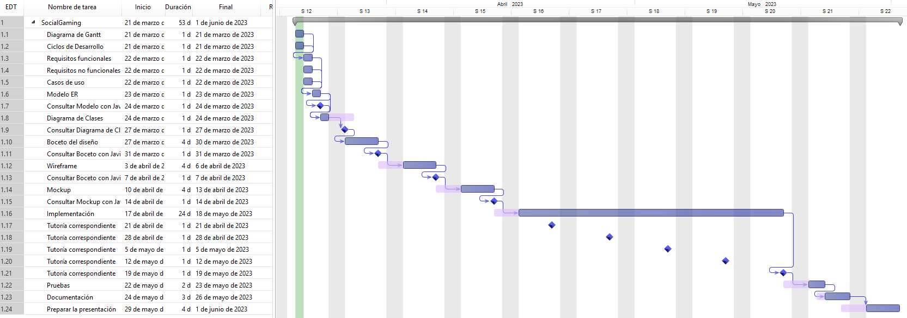
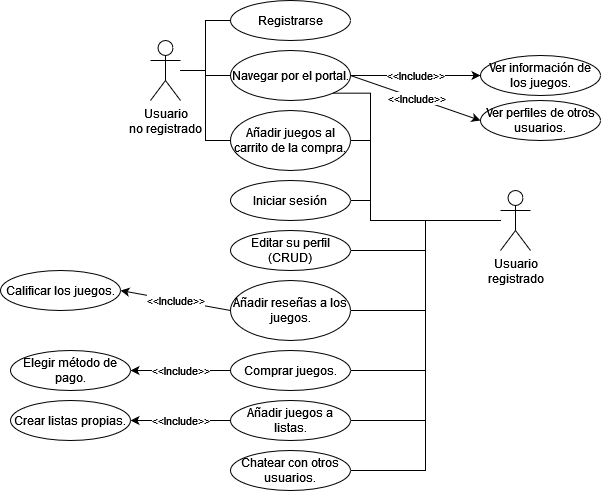
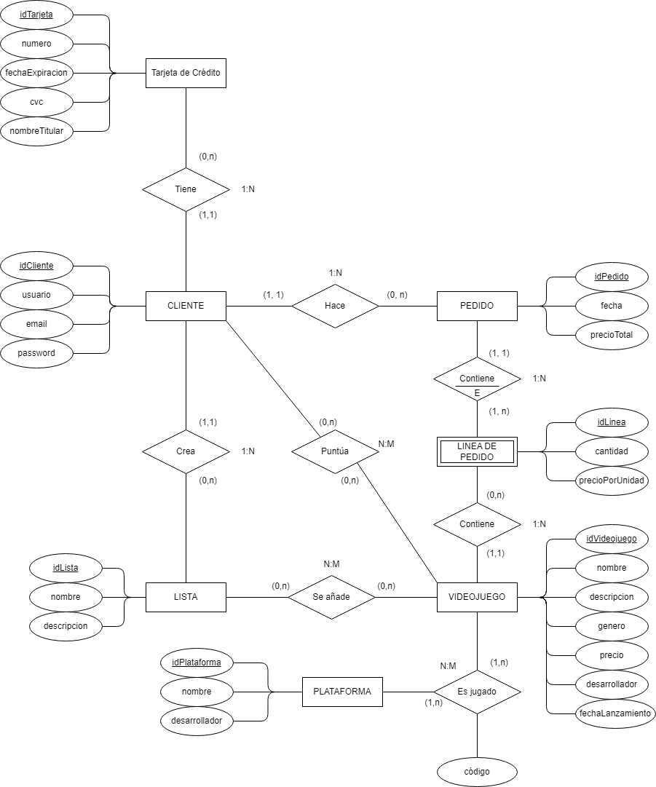
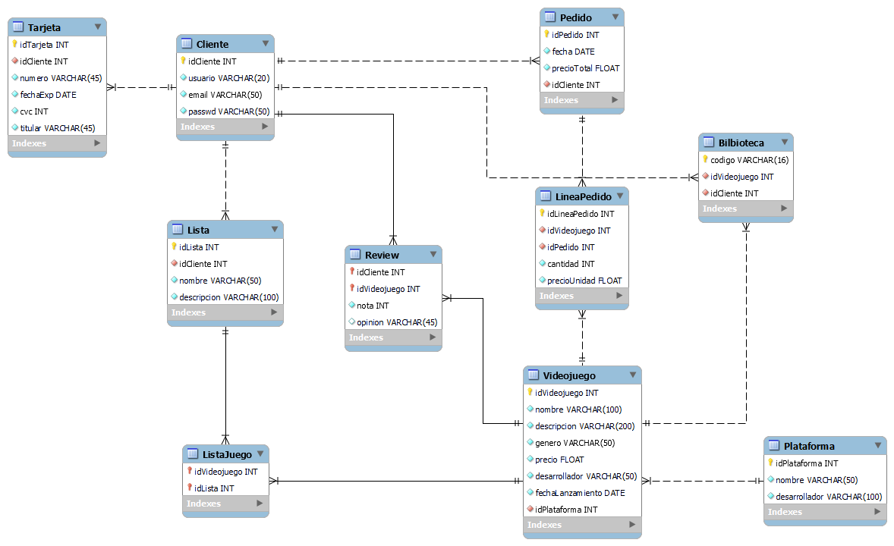
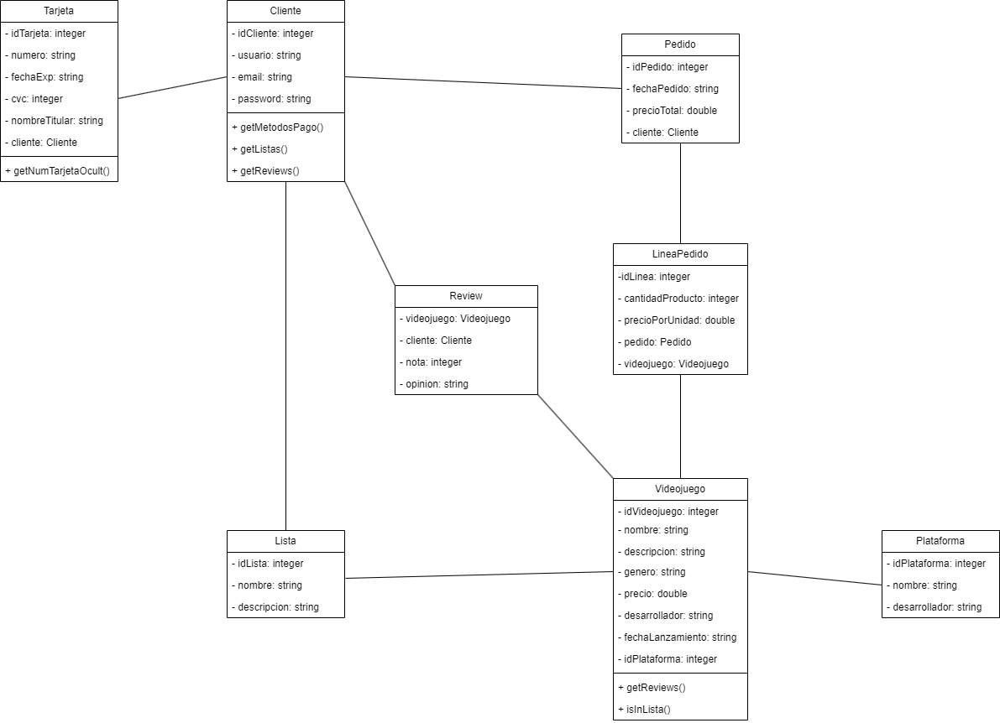
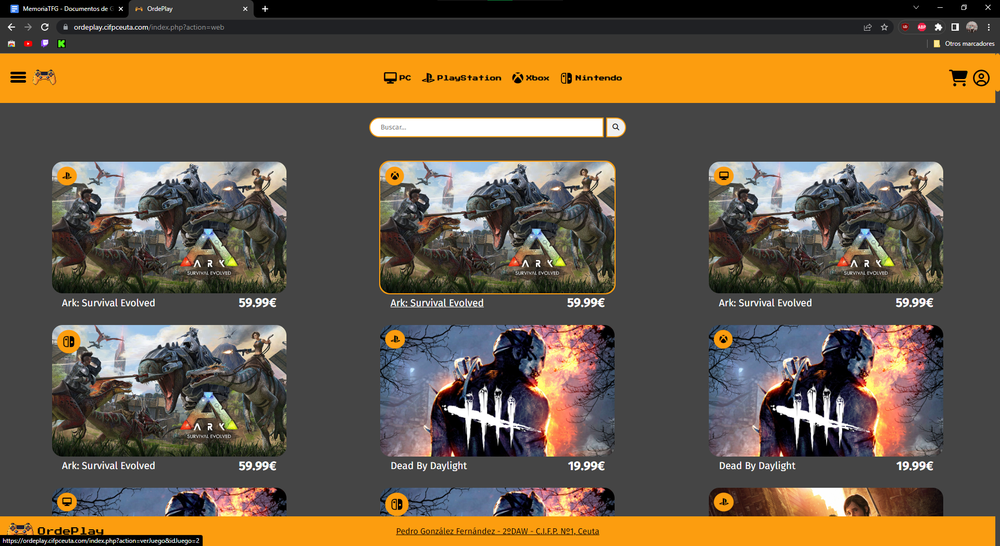

# OrdePlay

---

# Introducción

Mi proyecto consiste en el desarrollo de una aplicación web enfocada a la **compra de videojuegos de forma online**. Los clientes podrán pagar por los diferentes juegos presentes en la web y esta les devolverá un código único a través de su correo electrónico, dependiendo de la plataforma de juegos que haya elegido y el juego en cuestión.

La aplicación incluirá otras características como la posibilidad de **añadir los diferentes juegos**, comprados o no, a unas **listas**. Estas pueden ser **por defecto** o **creadas por el propio usuario** para mayor personalización.

Estas dos ideas no son nuevas, páginas como [**InstantGaming**](https://www.instant-gaming.com/es/) permite comprar juegos de forma online y otras como [**Backloggd**](https://www.backloggd.com/) permite crear listas personalizadas y añadir juegos a las mismas. Pero la idea de juntar estas dos funcionalidades me parece algo útil y funcional para los usuarios.

# Planificación

## **Ciclo de desarrollo**

---

- Introducción.
    - En esta fase del proyecto se expone la idea general sobre la cual se va a desarrollar el proyecto.
- Planificación
    - En esta fase se planean las partes en las que se va a dividir el proyecto y el tiempo dedicado a una de ellas.
- Análisis de software.
    - Fase en la que la idea ya tiene una forma clara y se analiza lo que va a hacer la aplicación.
- Diseño lógico.
    - En esta fase se diseña el modelo de datos y la estructura de la aplicación.
- Diseño de Interfaz.
    - En esta fase del desarrollo se diseña la interfaz de usuario que tendrá la aplicación.
- Implementación.
    - Aquí se van implementando todos los diseños sobre la aplicación.

## Diagrama de Gantt

---



# Análisis de Software

## Requisitos funcionales

---

- Los **usuarios no registrados** deberán poder registrarse.
- Los **usuarios registrados** deberán poder iniciar sesión.
- **Todos los usuarios** deberán poder añadir juegos al carrito de la compra, además **el carrito**:
    - Deberá mostrar las diferentes líneas de pedido con su precio por unidad.
    - Deberá mostrar el precio total de todas las líneas de pedido.
    - Si el **usuario está registrado**, el carrito deberá permitir comprar los diferentes juegos añadidos.
- La **web** enviará por email un código único para cada juego dependiendo de la plataforma una vez comprado el juego.
- Los **usuarios registrados** deberán poder gestionar la información de su perfil.
- Los **usuarios registrados** deberán poder crear listas propias.
- Los **usuarios registrados** deberán poder añadir juegos a las listas, ya sean por defecto o propias.
- **Todos los usuarios** dispondrán de un portal de contenido a través del cual navegar y ver información de los diferentes juegos y perfiles de otros usuarios.
- **Todos los usuarios** podrán ver en su portal las listas por defecto. Los usuarios registrados podrán ver además las listas que ellos mismos hayan creado.
- **Todos los campos** han de estar correctamente validados.
- Las **contraseñas** deberán tener un formato seguro.
- 

## Requisitos no funcionales

---

- Las **contraseñas** deberán estar encriptadas.
- Los **métodos de envío de información** deberán ser seguros.
- La **base de datos** deberá ser relacional.
- **Diseño** orientado a objetos.
- **Modelo Vista Controlador**.
- Uso de **PHP**, **JS**, **HTML**, **CSS** y **MySQL**.
- 

## Casos de uso

---



# Diseño Lógico

## Modelo Vista Controlador

---

Mi proyecto estará desarollado bajo el paradigma de MVC, dónde:

- El **modelo** representará las diferentes clases del diagrama de clase, contendrá la lógica de la aplicación e interactuará con la base de datos.
- La **vista** será la representación visual de los datos al usuario, la interfaz de la aplicación.
- Y el **controlador** hará de intermediario entre el modelo, del que recibirá la información, y las vistas, dónde enviará dicha información.

## Modelo E/R

---



## Modelo Relacional

---



*La tabla Biblioteca sale de la compra del juego, almacenará el código de compra del mismo, junto a su id y la del usuario que lo ha comprado.

*La base de datos ya está normalizada.

## Diagrama de clases

---



# Diseño de la Interfaz

## Guía de Estilo

---

[Guía de Estilos](https://www.notion.so/Gu-a-de-Estilos-0bd8528fbc434f8c964064a8f3f73d1e?pvs=21)

## Justificación del Layout

---

El layout de la página sigue una estructura de **columnas**, con el contenido principal **centrado verticalmente** en la pantalla. Esto proporciona un enfoque **limpio y sencillo**, permitiendo que el contenido destaque sin distracciones.



Esto también facilita la estructura en la **versión móvil**, al ser columnas, todo el contenido **se centra en una columna** y permite disfrutar del mismo contenido sin restricciones.


En la vista del **perfil del usuario** es la única que difiere con el resto de la página, teniendo **dos secciones**, una superior con **información sobre el usuario** y otra inferior con un **menú de navegación** que permite **mostrar diferentes opciones al usuario** sin necesidad de cambiar de página.


Aún así, los resultados en ocasiones se muestran en **columna**, respetando el **paradigma principal**.

# Implementación

## Desarrollo en Entorno Cliente

---

### Document Object Model (DOM)

---

En mi proyecto, **manipular el DOM** ha sido una parte importante, sobre todo en los formularios, añadiendo un **mensaje de error** dependiendo de la respuesta que da el servidor.


Además, de otros usos como, por ejemplo, desplegar un **menú de selección** a la hora de añadir un juego a una lista.


### Eventos

---

Mi aplicación hace uso de los **eventos** en diversas ocasiones, como por ejemplo:

- En los formularios de inicio de sesión, registro o cambio de contraseña, está presente un icono que representa un ojo que, al pulsar sobre él, **permite ver la contraseña**, además de cambiar una clase para que el **icono se muestra de forma diferente**.
- A la hora de añadir un juego a una lista, para que el menú se muestre, hay un evento sobre el icono ‘+’ para **hacerlo visible** y **colocarlo en el sitio correcto**.
- También es usado para mostrar un **placeholder** en los campos de los formularios **cuando estos tienen el foco**, y quitarlo **cuando pierden el foco**.
- 

### AJAX

---

He utilizado AJAX para comunicarme con el servidor a la hora de validar los datos de los formularios. Se hace un envío de los datos al servidor, allí se validan y se trabaja con ellos y, dependiendo de lo procesado, este devuelve un mensaje u otro en formato JSON. Con ese resultado, en el cliente, se realiza una acción que se muestra en tiempo real sin actualizar la página.

### Extra

---

Como extra, he usado jQuery para desplegar el menú hamburguesa o cambiar de opción en la vista del perfil del usuario. Y también he usado cookies para crear el carrito de forma sencilla, y así el usuario no tiene la necesidad de iniciar sesión para tener un carrito, pero si lo necesitará para pagarlo. A su vez, los datos de las cookies han sido procesados desde el servidor, ya que, al almacenarse en el navegador, es posible acceder a las mismas tanto desde el cliente como desde el servidor.

## Diseño de Interfaces Web

---

Aparte de lo visto anteriormente, mi página cuenta con mucho flexbox y grid. Esto se puede ver ya en la primera vista del proyecto, donde tenemos una cuadrícula grid que muestra todos los juegos y, en el header, un menú de navegación hecho con flex. Esto ha facilitado mucho implementar el paradigma de columna en las páginas, además de ser responsive y hacer mucho sencillo implementar la versión móvil.

Mi proyecto es responsive, pero no ha seguido el paradigma “Mobile first”, puesto que, al ser una tienda online de videojuegos, pienso que la gran mayoría de usuarios accederá a ella desde un dispositivo de escritorio, por lo que he decidido darle prioridad a estos. No obstante, considero que la versión móvil está conseguida y es igual de funcional, intuitiva y profesional que la versión de escritorio.

## Despliegue de Aplicaciones Web

---

Todo el proyecto ha sido subido a un **hosting** dado por el centro, a través de **FTP**, además de ser subido a **GitHub**.

## Base de Datos

---

El modelo **entidad relación** y **relacional** ya han sido mostrados anteriormente, además de esto, en mi proyecto están presentes diversas consultas, entre las cuales hay alguna que emplea **JOINs** para hacer **uso de varias tablas**, como por ejemplo:

```php
"SELECT * FROM Videojuego v JOIN Biblioteca b ON v.idVideojuego = b.idVideojuego WHERE b.idCliente = ". $this->idCliente;
```

Además de consultas de **inserción**, **actualización** y **borrado** de datos.

## Desarrollo en Entorno Servidor

---

### Sesiones / Cookies

---

En mi proyecto se hace uso de las variables de sesión para tener en todo momento acceso a los datos del usuario que ha iniciado sesión. De esta forma no es necesario estar trayendo de la base de datos dicha información todo el rato, ni es necesario pasar los datos de una vista a otra, puesto que en la sesión siempre están disponibles.

Las cookies han sido usadas para crear el carrito, desde JS, pero para mostrarlo en pantalla y procesarlo se ha usado PHP, ya que, como he dicho anteriormente, las cookies se pueden manipular tanto desde el cliente como desde el servidor.

### Programación Orientada a Objetos

---

Por supuesto, mi proyecto está desarrollado usando POO, como hemos visto anteriormente en el diagrama de clases.

### Control de Excepciones

---

En mi proyecto, cuento con control de excepciones an algunas consultas a la base de datos que pueden dar error, por intentar insertar datos duplicados.

```php
try{
	if ($this->connection->query($sql)) {
		return true;
  } else {
    return false;
  }
} catch(Exception $e) {
	return false;
}
```

### CRUD

---

En mi proyecto está muy presente la Base de Datos, por lo que cuenta con todo tipo de consultas, tanto de selección, como de borrado, inserción y actualización.

### Arquitectura MVC

---

Como he explicado anteriormente, mi proyecto está desarrollado bajo el paradigma MVC.

## Empresa e Iniciativa Emprendedora

---

### Definicion del producto/servicio en el mercado

---

La aplicación web que se está desarrollando es una plataforma de compra de videojuegos online que ofrece a los usuarios la posibilidad de adquirir juegos a través de la plataforma y recibir códigos únicos para su activación o descarga. Además, la aplicación permite a los usuarios crear y gestionar listas personalizadas de juegos, tanto aquellos que han comprado como los que desean adquirir en el futuro.

Esta aplicación web se diferencia al combinar la conveniencia de la compra de videojuegos en línea con la capacidad de organizar y personalizar las listas de juegos. Los clientes podrán explorar una amplia selección de juegos disponibles en la plataforma, realizar pagos seguros y recibir los códigos únicos necesarios para disfrutar de sus juegos en la plataforma correspondiente.

Las principales características y beneficios de esta aplicación web son:

1. **Compra de videojuegos online**: Los usuarios podrán acceder a una amplia variedad de juegos disponibles en línea y realizar compras de manera conveniente desde la comodidad de su hogar.
2. **Códigos únicos**: La plataforma proporcionará a los clientes códigos únicos para cada juego comprado, lo que les permitirá activar o descargar el juego según la plataforma elegida.
3. **Listas personalizadas**: Los usuarios podrán organizar y gestionar sus juegos en listas personalizadas. Estas listas pueden ser creadas por defecto o adaptadas según las preferencias de cada usuario, lo que facilita el acceso rápido y la personalización de la biblioteca de juegos.
4. **Experiencia de usuario mejorada**: La aplicación se diseñará teniendo en cuenta la facilidad de uso y la experiencia del usuario, brindando una interfaz intuitiva y amigable para una navegación sin complicaciones.

En resumen, esta aplicación web dedicada a la compra de videojuegos online con características de almacenamiento y organización de listas personalizadas busca brindar a los usuarios una forma conveniente y personalizada de adquirir y gestionar sus juegos favoritos.

### Análisis Dafo

---

|  | INTERNO | EXTERNO |
| --- | --- | --- |
| POSITIVO | Amplia selección de videojuegos.
Comodidad y accesibilidad.
Personalización de listas. | Mercado en crecimiento.
Integración con plataformas de streaming.
Alianzas estratégicas |
| NEGATIVO | 
Problemas de seguridad y piratería. | Cambios en las políticas de distribución.
Piratería y reventa no autorizada.
Evolución de la tecnología.
Competencia.
Dependencia de acuerdos de distribución. |

**Análisis Interno**

**Fortalezas:**

- Amplia selección de videojuegos: Ofrecer una amplia variedad de juegos de diferentes géneros y plataformas puede atraer a una base de clientes diversa.
- Comodidad y accesibilidad: Al ser una aplicación web, los clientes pueden acceder y comprar juegos desde cualquier lugar con conexión a Internet, lo que les brinda comodidad y accesibilidad.
- Personalización de listas: La capacidad de crear listas personalizadas de juegos, tanto comprados como no comprados, brinda una experiencia más personalizada a los usuarios y les permite organizar sus preferencias de manera efectiva.

**Debilidades:**

- Problemas de seguridad y piratería: La venta de códigos únicos puede enfrentar desafíos en términos de seguridad, ya que existe el riesgo de piratería o reventa no autorizada de los códigos.

**Análisis externo**

**Oportunidades:**

- Mercado en crecimiento: La industria de los videojuegos ha experimentado un crecimiento significativo en los últimos años, lo que brinda oportunidades para captar una mayor base de clientes y aumentar las ventas.
- Integración con plataformas de streaming: Explorar la posibilidad de integrar la aplicación con plataformas de streaming de juegos populares podría atraer a usuarios interesados en probar juegos antes de comprarlos.
- Alianzas estratégicas: Establecer alianzas con desarrolladores o distribuidores de juegos reconocidos podría ayudar a obtener acceso exclusivo a juegos populares o brindar promociones especiales, lo que podría diferenciar la aplicación de la competencia.

**Amenazas:**

- Cambios en las políticas de distribución: Los cambios en las políticas de distribución de juegos por parte de los desarrolladores o plataformas existentes podrían afectar negativamente la disponibilidad de juegos para la aplicación.
- Piratería y reventa no autorizada: Existe el riesgo de que los códigos únicos de los juegos sean pirateados o revendidos de manera no autorizada, lo que podría afectar negativamente la reputación y la confianza de los usuarios en la aplicación.
- Evolución de la tecnología: La industria de los videojuegos está en constante evolución, y nuevas tecnologías, como los juegos en la nube o la realidad virtual, podrían cambiar la forma en que se compran y consumen los juegos, lo que podría requerir una adaptación constante de la aplicación.
- Competencia: El mercado de venta de videojuegos online es muy competitivo, destacar en un mercado saturado puede ser un desafío.
- Dependencia de acuerdos de distribución: Para ofrecer una amplia selección de juegos, la aplicación puede necesitar establecer acuerdos con desarrolladores y distribuidores de juegos, lo que podría ser complicado y requerir tiempo y recursos.

# Próximas Actualizaciones

---

Me gustaría añadirle una funcionalidad de **red social** a mi proyecto, de forma que los usuarios puedan navegar y ver el perfil de otros usuarios, sus listas (si son públicas), y chatear entre ellos.

También me gustaría incluir un foro, dónde los usuarios puedan comentar su experiencia con X juego, o ayudar a los usuarios que puedan tener dudas con dicho juego.

# Enlaces

---

GitHub → https://github.com/Pedrogf23/OrdePlay

Página del Proyecto → [https://ordeplay.cifpceuta.com/](https://ordeplay.cifpceuta.com/)